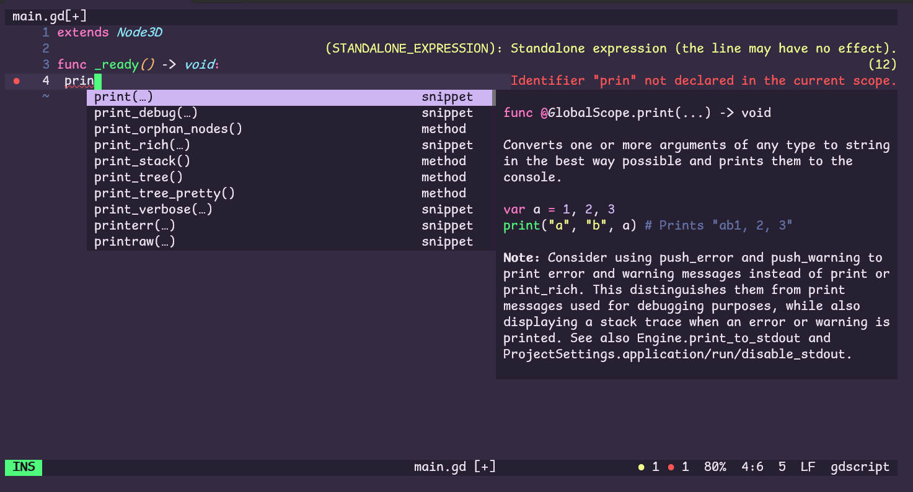
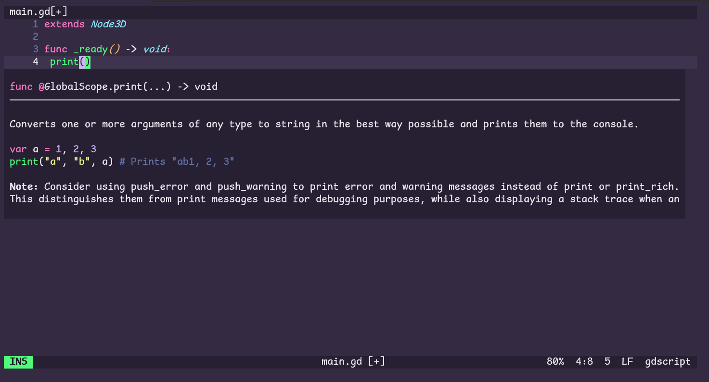
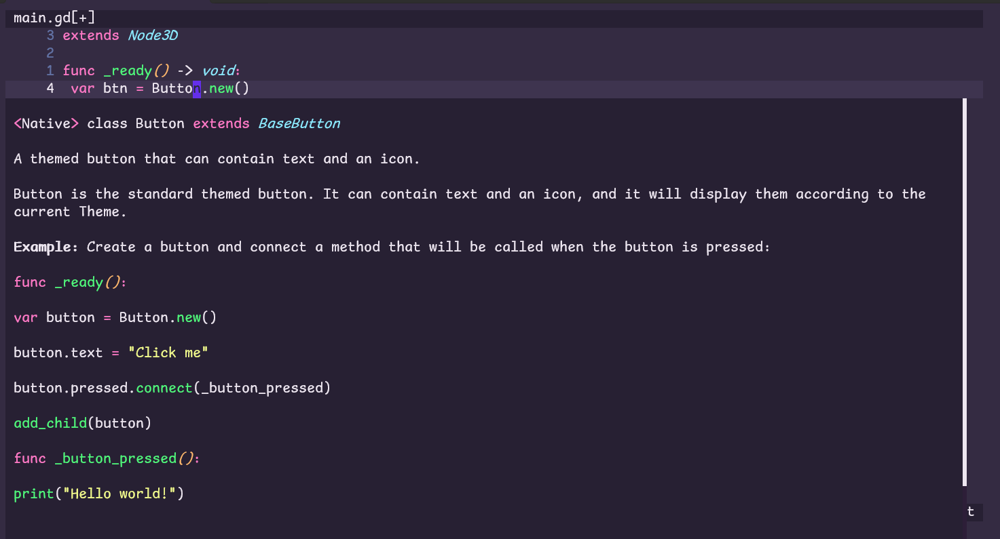

# HelixGodotProxy

A lightweight LSP proxy for improving Godot GDScript development in the Helix editor. For me, the nc/netcat/nmap solution wasn't a pleasant experience, so I created this.

## What Is This?

HelixGodotProxy sits between Helix and Godot's LSP server, transforming responses to provide better autocompletions, cleaner documentation, and proper syntax highlighting.

<table>
<tr>
<td></td>
<td></td>
</tr>
<tr>
<td colspan="2" align="center"></td>
</tr>
</table>

**Platform:** Cross-platform (.NET 9.0) - Works on Windows, macOS, and Linux

## Why Do You Need This?

Godot's LSP server sends documentation in BBCode format with embedded signatures and formatting issues (for Helix). This proxy:

- Extracts function/class signatures to display properly in autocomplete
- Converts BBCode to Markdown
- Removes duplicate signatures and extra blank lines
- Adds syntax highlighting to hover documentation

## Quick Start

### 1. Prerequisites

- .NET 9.0 SDK
- Helix editor
- Godot with LSP server enabled (runs automatically when Godot is open)

### 2. Installation

Build from source:
```bash
dotnet build --configuration Release
```

### 3. Configure Helix

Edit `~/.config/helix/languages.toml` (or `%APPDATA%\helix\languages.toml` on Windows):

```toml
[language-server.godot]
command = "path/to/HelixGodotProxy.exe"
args = ["log"]

[[language]]
name = "gdscript"
scope = "source.gdscript"
file-types = ["gd"]
language-servers = ["godot"]
```

## Configuration

### Logging Options

Logs are written to `HelixGodotProxy.log` in your Godot project directory.

| Flag | Description |
|------|-------------|
| *(none)* | Silent (default) |
| `log` | Normal (INFO, ERROR) |
| `logv` | Verbose (+ DEBUG) |
| `logvv` | Very Verbose (+ WARNING) |

### Connection Options

| Flag | Default | Description |
|------|---------|-------------|
| `--host`, `-h` | `localhost` | Godot LSP server host |
| `--port`, `-p` | `6005` | Godot LSP server port |

### Example Configurations

**Basic (recommended):**
```toml
[language-server.godot]
command = "path/to/HelixGodotProxy.exe"
args = ["log"]
```

**Debug mode:**
```toml
[language-server.godot]
command = "path/to/HelixGodotProxy.exe"
args = ["logvv"]
```
> Beware! This will **flood** the log with thousands of lines!

**Custom port:**
```toml
[language-server.godot]
command = "path/to/HelixGodotProxy.exe"
args = ["log", "--port", "6006"]
```

**Remote Godot instance:**
```toml
[language-server.godot]
command = "path/to/HelixGodotProxy.exe"
args = ["log", "--host", "192.168.1.100"]
```
